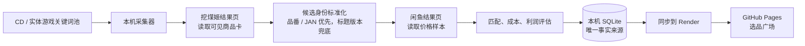

# 自动发现 CD／实体游戏价差选品广场：设计规格

日期：2026-09-06

## 1. 产品目标

本项目的目标是持续发现**挖煤姬采购侧**与**闲鱼销售侧**之间存在价差的 CD、实体游戏机会，并按预计利润金额从高到低展示。用户打开选品广场后，应当看到可复核的候选商品，而不是先输入某一张 CD 的品番或 JAN。

品番和 JAN 仍然很重要，但它们只作为匹配证据：有品番或 JAN 时采用精确匹配；没有时使用标题、艺人／作品名、版本、封面和关键词作降级匹配，并降低置信度。

第一期范围如下：

- 采购侧只读取挖煤姬的可见搜索结果页；不直接对接煤炉、雅虎或其他日本站点。
- 销售侧只读取闲鱼的可见搜索结果页。
- 本机保留已登录的浏览器档案并执行采集；Render 保存同步后的结果；GitHub Pages 负责在家中电脑查看选品广场。
- 不使用付费接口、代理池、验证码绕过、下单、加购、付款、私信或发布商品动作。
- CD 和实体游戏使用同一套候选模型，但拥有独立的关键词池、运费／包装参数和筛选规则。

## 2. 为什么采用“关键词池 + 分页轮询”

| 方案 | 做法 | 结果 |
| --- | --- | --- |
| 关键词池 + 分页轮询（采用） | 维护可编辑的 CD／实体游戏关键词池，逐个读取少量结果页并优先复核新卡片或价格变化卡片。 | 有明确预算、可长期低频运行，适合免费的本机浏览器采集。 |
| 全站类目扫库 | 持续遍历所有类目、页码和商品。 | 范围无法控制，重复率高，容易触发站点风控，无法给出稳定刷新周期。 |
| 第三方商品／价格接口 | 由外部服务提供商品流或价格数据。 | 会引入付费、额度或不稳定的依赖，不符合本项目约束。 |

默认周期设为 30 分钟，每个来源操作保持已有的随机等待；设置页允许调低到 15 分钟。每轮按预算处理候选，避免把“发现机会”误做成无止境的站点遍历。

## 3. 端到端流程

每一张机会卡都必须保留：挖煤姬链接与采购价、闲鱼样本数与参考价、成本拆分、预估利润、匹配置信度、最后一次观察时间和风险标签。前端展示的是“值得人工复核的机会”，不是保证可成交的利润。

## 4. 候选发现与匹配规则

### 4.1 候选池

创建两个默认池：`cd` 和 `physical_game`。每个池保存：

- 启用状态、扫描间隔、每轮关键词数、每个关键词页数和候选上限。
- 可编辑的包含关键词、排除关键词、版本／品相排除词。
- 该类目的运费、包装、售后预留、重量／件数假设和税费预留参数。
- 最低预计利润、最低利润率、最低匹配置信度和最低有效闲鱼样本数。

采集器每轮从到期的关键词开始，保留来源页面、截图和解析摘要。只将可见、未标记售罄且通过基础排除词的挖煤姬卡片送入候选池。

### 4.2 身份键

候选的稳定身份键按以下优先级生成：

1. 品番；
2. JAN；
3. 来源商品 ID；
4. 规范化后的“作品／艺人 + 标题 + 版本”哈希。

第 1、2 类身份可直接作为闲鱼搜索词。第 3、4 类使用标题与版本组成搜索词，并要求更高的文本或封面一致性。旧系统的 `catalog_no` 字段继续保留给历史单品监控；新候选使用单独的 `identity_key`，页面不再把它称为“品番”。

### 4.3 评估与排序

复用现有的闲鱼噪声清洗、成本模型、匹配置信度和机会去重能力。每个机会按以下顺序排序：

1. 预计利润金额降序；
2. 匹配置信度降序；
3. 有效闲鱼样本数和流动性；
4. 最近一次观察时间。

采购成本仍由已存在的代理费、日内运费、国际运费、国内转寄、包装、售后和风险预留组成。税费不依据“少于二十碟”自动推断；它作为媒体池成本参数显示在成本拆分中，用户可按自己的运输和申报方案调整。

### 4.4 新鲜度与去重

- 同一来源商品价格、可售状态或版本信息没有变化时，不重复查询闲鱼。
- 新商品、价格变化商品和超过复核时限的商品进入闲鱼查询队列。
- 已售罄商品立刻标为 `expired`；连续三次成功的来源扫描没有再次看到的商品标为 `stale`，默认不出现在利润榜。
- 采集失败、登录失效或验证码不会把现有机会误标过期，而是记录为 `human_required` 并暂停该来源。

## 5. 数据和接口

在现有 SQLite 数据库中新增下列实体，并通过幂等迁移创建：

| 实体 | 核心用途 |
| --- | --- |
| `discovery_pools` | CD／实体游戏池的频率、预算、阈值和成本配置。 |
| `discovery_keywords` | 每个池的搜索词、权重、启用状态和最后扫描时间。 |
| `discovery_runs` | 单轮的开始结束、来源状态、数量、错误和截图／快照路径。 |
| `discovery_candidates` | 挖煤姬发现的规范化候选、身份键、媒体类型、最后观察时间和状态。 |
| `collector_commands` | 家中页面发出的“立即扫描、启停、更新池配置”命令及本机确认结果。 |

`market_items`、`xianyu_price_samples` 和 `opportunities` 继续保存价格证据和利润结果，并增加对 `discovery_candidate_id`、`media_type`、`identity_key` 和 `last_seen_at` 的关联字段。原来的 `watchlist` 仍保留为“高级：指定单品复核”功能，不作为首页入口。

新增 API 分为三类：

- 选品广场：读取池状态、候选、机会和按利润排序的分页数据。
- 远程控制：GitHub Pages 向 Render 写入启停、立即扫描和配置命令；本机采集器轮询并回传执行状态。
- 本机执行：只允许已登录浏览器所在机器运行发现扫描，并向 Render 同步 SQLite 副本。

本机 SQLite 是唯一事实来源。Render 的免费临时文件系统只保存可恢复副本：采集器每次处理远程命令前先拉取命令，写入本机数据库后再上传副本。若 Render 重启而命令尚未被本机确认，页面会显示未确认状态，用户可重发；已确认的配置会由下一次同步恢复。

## 6. 页面调整

首页改为“选品广场”，包含：

- 今日扫描状态、最后同步时间、活跃候选数、有效机会数和预计利润最高值。
- 按预计利润金额默认降序的机会流，可按 CD／实体游戏、置信度、风险、价格区间和新鲜度筛选。
- 每张机会显示来源图、标题／版本、采购价、落地成本、闲鱼参考价、预计利润、利润率、样本数、置信度和最后观察时间。
- “采集设置”页：编辑两个候选池和关键词；不再要求先填写具体 CD 目标。
- “立即扫描”仅提交给本机采集器的队列命令；页面显示“待本机接收、执行中、完成、需要人工处理”四种状态。

现有“新建任务”入口改名为“高级单品复核”，并移到次级页面，避免误导成选品广场的必经步骤。

## 7. 分阶段交付

### 第一段：可验证的候选池闭环

1. 数据迁移、候选身份模型、池／关键词 CRUD 和执行状态接口。
2. 以固定 HTML 夹具驱动的发现扫描，验证从挖煤姬卡片到闲鱼样本、利润机会和排序的完整链路。
3. 选品广场页面改造，默认展示自动机会榜；高级单品监控从主流程移出。
4. 本机调度器和远程命令确认流程，保证在家中发起的“立即扫描”由采集电脑执行。

### 第二段：接入已登录的真实浏览器

1. 将现有只读 Playwright 搜索快照能力从“指定品番”扩展到“关键词池”。
2. 用用户已登录的挖煤姬和闲鱼档案执行低频冒烟扫描，保存截图和解析数量。
3. 根据真实页面结构补齐解析器选择器，并把任何验证码／登录失效停在人工处理状态。

### 第三段：运营稳定性

1. 候选复查预算、过期策略、失败退避和运行日志。
2. 利润榜筛选、导出和人工复核反馈，以便逐步收紧关键词池。

## 8. 验收标准

- 用户无需提供任何单品编号，即可启用 CD 和实体游戏候选池。
- 一次成功扫描能留下采购侧卡片、闲鱼样本、成本拆分和可排序的机会记录。
- 机会榜默认严格按预计利润金额从高到低排列，并能看见匹配证据与最后观察时间。
- 本机未登录、站点出现验证码或解析异常时，系统不产生伪造机会，也不执行交易动作。
- 家中 GitHub Pages 能读取 Render 的最新副本，并能看到远程命令是否已被采集电脑接收和完成。
- 全流程不依赖付费接口；浏览器采集仅读取可见结果页。

## 9. 已确定的实施假设

- 默认先同时提供 CD 与实体游戏池，但实际扫描数量由每池预算限制，不做无边界全站抓取。
- 默认 30 分钟扫描一次，可在设置中改为 15 分钟或更长。
- 低置信度的标题兜底匹配可以进入“待复核”，不进入默认利润榜。
- 成本模型默认显示假设项，尤其是运输、件数和税费预留；用户以后可在媒体池设置中改动这些参数。
